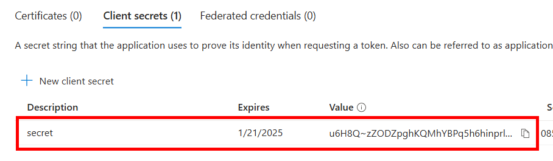

# Azure Monitoring 

Azure 리소스 모니터링을 위해 다양한 방법이 존재

VM 의 CPU, Memory, Disk 등의 숫자형태로 표현가능한 로그는 `플랫폼 메트릭` 형태로 Azure Monitor 메트릭 데이터베이스에 저장이 되며 데이터를 직접 접근 할 수는 없음.

Log Analytics Workspace 를 생성하고 메트릭 데이터를 Log Analytics WS에 저장 하도록 구성하는 경우  `Perf` 테이블에 저장됨

- VM 의 경우에는 `Monitoring-Insights` 설정으로 구성
- 다른 리소스(스토리지, NIC 등)는 `Monitoring-Diagnostic Setting`을 통해 메트릭을 Log Analytics WS에 저장하도록 구성 가능
- Azure Monitor Agent 를 통해서 수집되는 로그 또한 Log Analytics Workspace 로 저장

> Azure Monitor Workspace 에는 현재(2024년 7월)기준 Prometheus 메트릭만 저장


## 플랫폼 메트릭
Azure 리소스의 메트릭 로그는 타임스탬프 분석에 최적화된 시계열 데이터베이스에 저장됨. 시간에 따른 추세 분석에 용이함.
VM 의 경우 Host 메트릭 항목과 Guest 메트릭 항목은 종류가 다름.

## 활동 로그
특정 리소스가 생성되거나 변경 등에 대한 활동이 발생된 경우 기록되는 로그이며 모든 Azure 리소스는 기본 저장.
Azure Resource Manager 의 endpoint 는 https://management.azure.com/~ 이고 Azure Portal 이든, Azure CLI 이든 리소스 관리 활동이 발생 된 경우 활동 로그를 기록 함.
리소스 변경이 발생된 경우 발생 시킨 주체(사용자)를 반드시 기록.

## 리소스 진단 로그
리소스 마다 저장되는 진단로그 항목은 다르며 로깅을 남기고 싶은 항목에 대해 구성 가능
VM 의 경우 진단로그가 VM insights 로 대체되었고, 다른 리소스와 같이 진단로그 추가 설정을 위해서는 활동로그의 `Export Activity Logs` 메뉴에서 설정 가능.

_(Blob 스토리지의 진단 로그 설정 예시)_


## 로그 분석을 위한 Log Analytics Workspace
리소스의 로그를 저장하기 위해서 Log Analytics Workspace 내의 [`Table`](https://learn.microsoft.com/ko-kr/azure/azure-monitor/logs/manage-logs-tables?tabs=azure-portal) 에 저장이 됩니다.


각 로그의 테이블은 기본값으로 30일동안 저장이 되며 최대 2년, 보관 12년 까지 가능합니다.

Log Analytics Workspace 의 Logs 에서 `쿼리`를 선택하고 필요한 쿼리 예제를 참조하여 쿼리를 실행할 수 있습니다. `New alert rule`을 이용하여 작성된 쿼리 기반으로 최소 1분 주기로 쿼리를 실행하여 알람 발송을 보낼 수 있습니다.


알람 발송을 위해서는 `Alert Evaluation Engine`이 약 **5분 주기**로 스케줄링이 되며 `Condition` 에는 최소 1분 단위부터 지정 할 수 있습니다.
그러므로 Alert 을 발송하기 위해서는 `최소 1분` 보다 큰 간격으로 `Fired Alerts` 이벤트를 통해 알림일 발송됩니다. (1분에서 5분 사이 이므로 평균 2~3분)


## Alert(알람) 
대부분의 Azure 리소스 에 `Monitoring-Alerts` 기능을 이용하여 사용자 정의 메트릭 또는 로그에 대해서 알람 설정을 통해 Email, SMS, Webhook 등을 통해 알림을 받을 수 있습니다.

알림을 보내기 위해서는 `Actions Group` 을 생성하게 되는데 `Notifications` 에는 Email, SMS, Notification Push, Voice call 로 알람을 발송 할 수 있으며, `Actions` 에서는 아래 그림 처럼 Function 부터 Webhook 까지 다양한 방법을 통해 알람 발송이 가능합니다.


다만, 조건을 충족하는 경우 알람을 발송하기 까지 5분 주기로 체크 하므로 최대 5분이 소요될 수 있습니다.
이를 줄이기 위해서는 `알람 발송 엔진`에서 알람을 발송 하는게 아닌, Logic App, Function App 등으로 주기적으로 Log Analytics Workspace 의 로그를 확인하여 직접 알람 발송을 구현 할 수 있습니다.

예를 들어 10초 주기로 Logic App 또는 Azure Function 앱을 실행하며 로그를 쿼리하여 조건에 맞는지 확인 하는 경우에는 이벤트 발생 후 `1분 10초` 이후에 알람을 원하는 형태로 받을 수 있습니다. 

### 리소스에서 메트릭 추세에 대한 알람 설정 방법

1. 리소스의 `모니터링-알림`을 선택 하고 `새 알림`을 선택하여 `알림 규칙` 선택


2. `조건` 탭에서 시그널을 선택 (예제에서는 CPU 사용율 80% 사용), 체크 주기와 검토 기간을 각 1분으로 선택하고 `작업` 탭으로 이동


3. `액션 그룹`을 생성


4. `알림` 에서 Email 을 선택하여 받을 이메일을 적어주면 정의된 템플릿으로 메일이 발송됩니다.


5. 상세한 로그 데이터 확인을 위해서 `Notification` 을 그대로 두고 `Actions`에 Azure Function 을 선택 하여 생성해 둔 Function 을 선택 하면 상세 로그 확인 가능.

    ### 상세 로그 확인을 위한 Function App 생성 방법
    1. 리소스 만들기 선택 후 `Function App` 또는 `함수`로 검색 후 만들기
    

    2. 런타임 스택을 PowerShell 뿐만 아니라 원하는 프로그래밍 언어 선택 후 Monitoring 에 반드시 `Application Insights`를 활성화 해야 합니다.
    

    3. Function App 에서 Function 만들어서 알림 상세 로그 출력하기 위해서 생성된 함수앱의 개요에서 `포탈에서 만들기` 선택
    

    4. HTTP 트리거 선택 후 기본값으로 만들기
    

    5. 만들어진 함수 앱의 내용 중 불필요한 내용을 삭제 하고 아래와 같이 변경 후 저장
    

    6. 상세 로그 확인을 위해 VM과 같은 이로스의 알림을 1~4단계 까지 진행 하고 4단계에서 `작업` 추가에서 Azure Function 을 다음처럼 방금 생성한 함수앱 선택 (테스트를 위해서 CPU 사용율을 1%로 설정함)
    

    7. Function App 의 `Log Stream` 화면에 로그가 스트리밍으로 기록됨.

    ### VM insights 를 통해 Log Analytics Workspace 에 기록이 된 로그를 매 10 초 마다 확인 하는 방법
    1. VM 의 `모니터링-insights` 를 활성화(Log Analytics Workspace 가 없는 경우 생성 필요)
    2. 다음처럼 Log Analytics Workspace 의 `Logs`에서 쿼리를 통해 실행 중인 VM 의 CPU, Memory, Disk 에 관련된 메트릭 추출 가능
    
    
    _(사용된 쿼리)_
    ```
    // 쿼리는 검증이 필요함.
    // CPU, Memory, Disk 사용량 정보 조회

    let cpu = InsightsMetrics
    | where Namespace == "Processor" and Name == "UtilizationPercentage"
    | summarize AvgCpuUsage = avg(Val) by bin(TimeGenerated, 1m), Computer
    //| where AvgCpuUsage > 1 and TimeGenerated > ago(10m)
    | project TimeGenerated, Computer, AvgCpuUsage
    | order by TimeGenerated desc
    | take 10;

    let memory = InsightsMetrics
    | where Namespace == "Memory" and Name == "AvailableMB"
    | summarize AvgAvailableMB = avg(Val) by bin(TimeGenerated, 1m), Computer
    | project TimeGenerated, Computer, AvgAvailableMB
    | order by TimeGenerated desc
    | take 10;

    let logical_disk = InsightsMetrics
    | where Namespace == "LogicalDisk" and Name == "FreeSpacePercentage"
    | summarize AvgFreeSpacePercentage = avg(Val) by bin(TimeGenerated, 1m), Computer
    | project TimeGenerated, Computer, AvgFreeSpacePercentage
    | order by TimeGenerated desc
    | take 10;

    cpu | join kind=inner(memory) on Computer, $left.TimeGenerated == $right.TimeGenerated
    | join kind=inner(logical_disk) on Computer, $left.TimeGenerated == $right.TimeGenerated
    | project TimeGenerated, Computer, AvgCpuUsage, AvgAvailableMB, AvgFreeSpacePercentage
    | order by TimeGenerated desc

    | take 1


    ```

    3. 위 쿼리와 유사하게 특정 쿼리를 일정 시간마다(매 10초, 매 1분 주기 등) 호출하기 위해서는 Azure Function 을 생성할 때 HTTP Trigger 가 아닌 Timer trigger 사용(10초 마다 실행 하려면 다음처럼 cron 표현식 설정)
    

    4. 함수 내에서 REST API 로 Log Analytics Workspace 의 로그를 확인하기 위해 앱 등록

        1. Entra ID 에서 `앱 등록` 선택 하여 앱 만들기
        

        2. 앱이 만들어 지면 앱 ID 를 메모장에 `복사`
        

        3. 인증서 및 비밀 에서 클라이언트 비밀 만들기
        

        4. 만들어진 앱 secret 를 메모장에 `복사` (이 키는 한번만 보여지므로 반드시 복사 필요)
        

        5. API Permission 에서 permission 추가 클릭 후 `APIs my organization use` 탭에서 `log` 로 검색하여 Log Analytics API 선택 후 `Delegated permissions` 선택하여 `Data.Read` 체크
        

        6. 다음처럼 권한이 추가됨을 확인
        

        7. 함수 앱 생성하여 내용을 다음과 같이 작성

            ```
            # 변수 설정
            $tenantId = "<테넌트 ID>"
            $clientId = "<앱 ID>"
            $clientSecret = "<앱 secret>"
            $resource = "https://api.loganalytics.io"

            # API 엔드포인트 URL
            $url = "https://login.microsoftonline.com/$tenantId/oauth2/token"

            # 요청 본문 데이터 (폼 데이터 형식)
            $body = @{
                grant_type    = "client_credentials"
                client_id     = $clientId
                client_secret = $clientSecret
                resource      = $resource
            }

            # POST 요청 보내기
            $response = Invoke-RestMethod -Uri $url -Method Post -ContentType "application/x-www-form-urlencoded" -Body $body

            # 응답 출력
            $response

            $access_token = $response.access_token


            $url = "https://api.loganalytics.io/v1/workspaces/<Log Analytics Workspace ID>/query"

            # 요청 본문 데이터 (JSON 형식)
            # Kusto 쿼리를 필요한 형태로 변경
            $body = @{
                "query" = @"
            InsightsMetrics
            | where Namespace == 'Processor' and Name == 'UtilizationPercentage'
            | summarize AvgCpuUsage = avg(Val) by bin(TimeGenerated, 1m), Computer
            | where AvgCpuUsage > 1 and TimeGenerated > ago(10m)
            | project TimeGenerated, Computer, AvgCpuUsage
            | order by TimeGenerated desc
            | take 1
            "@    
            } | ConvertTo-Json


            # HTTP 헤더 설정 (JSON 형식으로 데이터 전송을 지정)
            $headers = @{
                "Authorization" = "Bearer $access_token"
                "Accept"        = "application/json"
                "Content-Type"  = "application/json"
            } 

            # POST 요청 보내기
            $response = Invoke-WebRequest -Uri $url -Method Post -Body $body -Headers $headers
            $response.content

            # JSON 문자열을 PowerShell 객체로 변환
            $jsonObject = $response.content | ConvertFrom-Json

            # 파싱된 데이터 접근 예제
            $primaryResult = $jsonObject.tables | Where-Object { $_.name -eq "PrimaryResult" }
            $columns = $primaryResult.columns
            $rows = $primaryResult.rows


            # 데이터 출력 (쿼리에 따라 출력 값도 변경)
            # 조건에 따라 알림이 필요한 경우 알림 발송
            foreach ($row in $rows) {
                $timeGenerated = $row[0]
                $computer = $row[1]
                $avgCpuUsage = $row[2]

                Write-Output "TimeGenerated: $timeGenerated"
                Write-Output "Computer: $computer"
                Write-Output "AvgCpuUsage: $avgCpuUsage"
            }
            ```