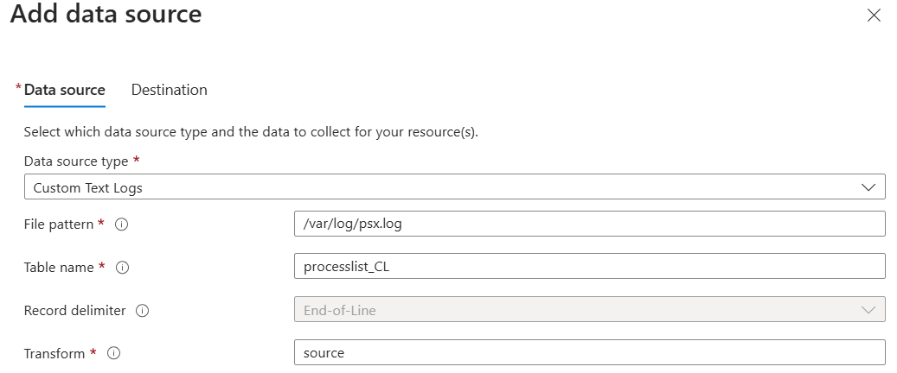
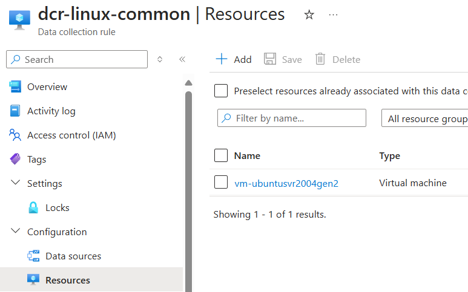
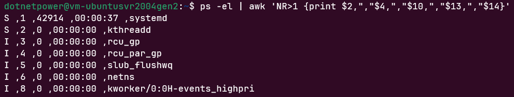
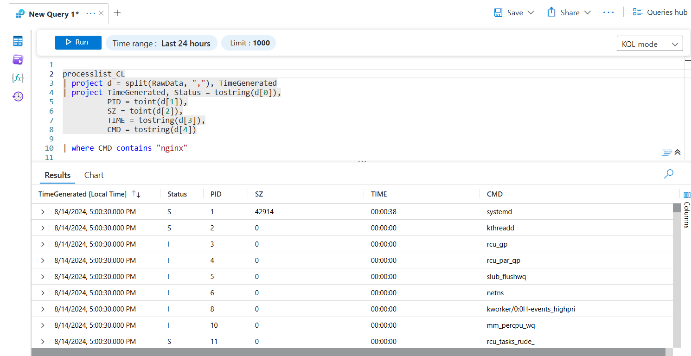

# 리눅스 커스텀 로그를 Log Analytics Table 에 저장하는 방안

https://learn.microsoft.com/ko-kr/azure/azure-monitor/agents/data-collection-log-text?tabs=portal

어플리케이션 로그, 쉘 명령 결과 또는 crontab 으로 실행되는 명령의 결과를 Azure Log Analytics 의 Table 로 보내고 쿼리 하는 방법

## 사용자 정의 테이블(Log Analytics) 생성
아래 명령으로 테이블 생성

```
#!/bin/bash

# Replace placeholders with actual values
subscriptionId="<your_subscription_id>"
resourceGroupName="<your_resource_group>"
workspaceName="<your_workspace_name>"
tableName="your_table_name"

# Construct the JSON payload
tableParams=$(cat <<EOF
{
  "properties": {
    "schema": {
      "name": "${tableName}_CL",
      "columns": [
        {
          "name": "TimeGenerated",
          "type": "DateTime"
        },
        {
            "name": "RawData",
            "type": "String"
        },
        {
            "name": "FilePath",
            "type": "String"
        }
      ]
    }
  }
}
EOF
)

# Construct the API endpoint
apiUrl="https://management.azure.com/subscriptions/$subscriptionId/resourceGroups/$resourceGroupName/providers/Microsoft.OperationalInsights/workspaces/$workspaceName/tables/${tableName}_CL?api-version=2021-12-01-preview"

# Set Azure authentication token (replace with your preferred authentication method)
authToken=$(az account get-access-token --query accessToken -o tsv)

# Send the PUT request
curl -X PUT "$apiUrl" \
  -H "Authorization: Bearer $authToken" \
  -H "Content-Type: application/json" \
  -d "$tableParams"

```

생성된 테이블은 Log Analytics Workspace 의 Table 에서 확인 가능

## Data Collection rule(데이터 수집규칙) 생성
데이터 수집 규칙의 소스 타입을 "Custom Text Logs" 로 선택하고 로그파일 경로 및 테이블 이름(대소문자 구분)을 다음과 같이 작성


생성하고 난 이후 리소스에서 수집 대상 VM 추가


## 로그 설정
예시) crontab -e 명령으로 수행할 스크립트 정의

```
매 1분마다 아래 명령 실행, 
ps -el 명령어를 실행하고 선택한 컬럼을 쉼표로 붙여서 출력
* * * * * ps -el | awk 'NR>1 {print $2,","$4,","$10,","$13,","$14}' > /var/log/psx.log
```
예시 결과)


## Kusto 쿼리를 통해 수집된 로그 결과 확인




